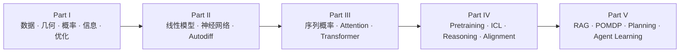

# From ML to Agent

> **《从机器学习到智能体》：从数学第一性原理理解 Machine Learning、Transformer、LLM 与 Agent**

现代 AI 的知识链已经从经典机器学习延伸到 Transformer、LLM 与 Agent。一路向前，我们会不断遇到新的模型、新的训练方法和新的系统范式，但许多核心问题始终来自同一组数学对象：概率分布、表示空间、损失函数、优化过程、信息获取与序贯决策。

这本书沿着这条主线展开。我们从向量、概率、信息论、优化和统计学习开始，逐步建立神经网络与表示学习，再进入序列概率、Attention 和 Transformer；随后讨论大语言模型的预训练、Scaling、解码、上下文学习、推理与后训练；最后把 RAG、工具调用、规划、记忆和多智能体放进决策理论的框架中。

希望读者在学完以后，能够顺着公式理解模型，顺着假设检查结论，顺着实验判断证据，也能够在面对一篇新的 AI 论文时，找到它真正改变的数学对象和研究问题。

**当前版本：v2.4 Final · 300 页 · 5 篇 · 22 章**

[📖 分章阅读教材](book/) · [🧪 运行 Labs](labs/) · [👩‍🏫 教师解答手册](instructor/Instructor_Solution_Manual_v2.4.pdf) · [✅ Final QA](docs/FINAL_QA_REPORT.md)

---

## 从 ML 到 Agent 的数学主线



全书从几个反复出现的母问题出发。

学习首先可以写成经验风险最小化：

$$
\theta^{\star}=\mathrm{argmin}_{\theta}\frac{1}{n}\sum_{i=1}^{n}L(f_{\theta}(x_i),y_i)
$$

语言模型进一步把序列写成一连串条件概率：

$$
p_{\theta}(x_{1:T})=\prod_{t=1}^{T}p_{\theta}(x_t\mid x_{1:t-1})
$$

Transformer 用可学习的表示进行内容寻址：

$$
\mathrm{Attention}(Q,K,V)=\mathrm{softmax}\left(\frac{QK^T}{\sqrt{d_k}}\right)V
$$

进入 Agent 以后，模型还需要根据观测更新对环境状态的信念，并据此选择后续动作：

$$
b_{t+1}(s')\propto p(o_{t+1}\mid s')\sum_s P(s'\mid s,a_t)b_t(s)
$$

从这些公式可以看到一条连续的演化路径：**函数学习 → 概率建模 → 表示学习 → 序列建模 → 决策与行动**。Transformer、LLM 和 Agent 都建立在前面已经出现的数学语言之上。

## 全书结构

| 篇 | 章节 | 核心问题 |
|---|---:|---|
| **Part I · 学习的数学基础** | 1–5 | 泛化、线性几何、概率、信息论与优化 |
| **Part II · 从线性模型到深度学习** | 6–10 | 线性动力学、Softmax 几何、表示学习、Autodiff 与深度训练 |
| **Part III · 从序列概率到 Transformer** | 11–14 | Next-token prediction、Token/Embedding、Attention 与 Transformer |
| **Part IV · 大语言模型理论** | 15–18 | 预训练与 Scaling、解码、ICL/Reasoning、SFT/DPO/RLVR |
| **Part V · 从 LLM 到 Agent** | 19–22 | RAG、MDP/POMDP、Tool Use/Planning、Memory/Multi-Agent/Learning |

完整的 22 章目录与逐章 PDF 入口见 **[`book/README.md`](book/README.md)**。每一章都配有对应的 Frontier Lab，理论学习和计算实验可以沿同一顺序推进。

## 一章是怎样展开的

每章从一个具体问题开始，先建立直觉和必要的先修知识，再进入正式数学对象。核心推导会说明假设、目标和中间步骤；重要结论会继续讨论几何意义、概率意义和适用边界。Worked Example 负责把抽象公式落到可以手算的规模，Visual Derivation 负责展示变量之间的结构关系，Problem Sets 与 Capstone 则把理解推进到证明、实验和研究判断。

全书目前包含 **40 个 Core Proof Files、11 套 Problem Sets、66 道课程题和 8 个跨章 Capstone**。这些内容可以支撑完整的自学路线，也可以拆分成一学期强化课程或两学期研究型课程。

## Research Frontier

基础理论讲清楚以后，教材会继续追问：**今天的研究正在改变哪个假设，解决哪个失败模式，又引入了什么新的问题？**

因此，Research Frontier 会直接接在相关数学知识之后。零空间连接到知识编辑，Attention 连接到 Gating、Sparse Attention 和长上下文，生成过程连接到 test-time compute 与 discrete diffusion，KL-regularized policy 推向 DPO，Value of Information、belief state 与 Bellman equation 最终汇入 Agent 的信息获取与规划。

Frontier 中的结论按照证据类型组织：**Theorem / Proposition、Derivation、Empirical Finding、Interpretation、Open Question**。读者可以据此分辨哪些结论来自形式化证明，哪些来自特定实验设置，哪些属于机制解释，以及哪些问题仍然值得继续研究。

## Labs：把数学机制变成可观察现象

仓库提供 **6 个基础实验 + 22 个逐章 Frontier Labs**。这些实验刻意保持小而透明，方便在普通 CPU 环境中运行，也方便直接修改参数、制造反例和观察机制变化。

例如，你可以观察 grokking 的谱动力学、知识编辑中的零空间、Attention gating、上下文熵、test-time compute、Bayesian ICL、DPO/RLVR、Agentic Retrieval、Tiger POMDP、闭环 replanning 与 multi-agent regret。

这些脚本承担 mechanism-level reproduction 的角色。论文级实验可以进一步沿 `docs/SOURCES.md` 中的论文与官方实现扩展到对应数据、模型规模和计算预算。

```bash
python -m venv .venv
source .venv/bin/activate          # Windows: .venv\\Scripts\\activate
pip install -r requirements.txt

python labs/frontier/ch13_gated_attention.py
python labs/frontier/ch20_belief_pomdp.py
```

实验说明见 [`labs/README.md`](labs/README.md)。

## 推荐的阅读方式

| 学习方式 | 建议路径 |
|---|---|
| **第一次系统学习** | 按 1 → 22 章顺序推进，重点阅读 Prerequisite Recall、Visual Derivation、Foundation 与 Worked Example |
| **研究导向学习** | 每章正文后继续阅读 Research Frontier，运行对应 Lab，并完成 evidence-boundary / counterexample 问题 |
| **课程教学** | 用 Problem Sets 组织阶段训练，用 Capstone 连接多个章节，用教师手册完成评分与讨论 |
| **专题复习** | 从 `book/README.md` 进入目标章节，再沿章节中的跨章引用回到所需数学基础 |

## 仓库内容

| 路径 | 内容 |
|---|---|
| `book/` | v2.4 Final 的 22 章分章 PDF 与章节导航 |
| `instructor/` | Instructor Solution Manual |
| `labs/` | 6 个基础实验 + 22 个 Frontier Labs |
| `docs/SOURCES.md` | Frontier 论文身份、会议入口与来源记录 |
| `docs/FINAL_QA_REPORT.md` | 最终数学、实验、排版与工程 QA |
| `docs/MATHEMATICAL_REVIEW_REPORT.md` | 数学严谨性审稿记录 |
| `docs/PEDAGOGY_REVIEW_REPORT.md` | 教学与可视化审稿记录 |

公开仓库聚焦阅读、实验与教学所需的材料。可编辑排版工程单独维护为 **Overleaf Edition**，便于后续在线修改和重新编译。

## 版本与维护

`v2.4 Final` 是当前冻结基线。它依次经历了全书形式化扩展、Proof & Problems、Mathematical Review、Pedagogy & Visualization Review 和 Final QA。后续版本会从这一基线继续演化，并保留 v2.4 作为稳定参考。

如果你发现公式错误、题目歧义、实验复现问题，或者 Frontier claim 与证据之间存在距离，欢迎通过 Issue 提交一个尽量小、可以复查的例子。

---

**希望读完这本书以后，当下一篇新论文出现时，你能够知道它在解决什么问题、依赖什么假设、证据支持到哪里，以及下一步还可以问什么。**
