# From ML to Agent

> **《从机器学习到智能体》：从数学第一性原理理解 Machine Learning、Transformer、LLM 与 Agent**

这不是一本“教你调用几个 API 就做出 AI 应用”的教程，也不是一本把热门论文和术语依次罗列的手册。

我们写这本书的出发点很简单：**如果一个学生只知道模型怎么用，却不知道损失函数为什么这样写、Attention 为什么这样计算、DPO 从哪里来、Agent 为什么应该被看成部分可观测环境中的序贯决策，那么他很难真正判断一个新方法究竟创新在哪里。**

因此，这本教材选择了一条更慢、但也更扎实的路线：从向量、概率、信息论、优化和统计学习开始，一步步“造出”神经网络、Transformer 和大语言模型；再把检索、推理、工具调用、规划、记忆和多智能体重新放回概率推断与决策理论中。最终目标不是让读者记住更多 AI 名词，而是让读者拥有足够的数学语言，去**读懂、复现、质疑，甚至开始提出自己的研究问题**。

**当前冻结版本：v2.4 Final · 300 页 · 5 篇 · 22 章。**

[📖 阅读教材 PDF](book/From_ML_to_Agent_v2.4.pdf) · [🧪 运行 Labs](labs/) · [👩‍🏫 教师解答手册](instructor/Instructor_Solution_Manual_v2.4.pdf) · [✅ Final QA](docs/FINAL_QA_REPORT.md)

---

## 一条贯穿全书的数学主线

```mermaid
flowchart LR
    A[数据与经验风险] --> B[向量 / 概率 / 信息]
    B --> C[优化与泛化]
    C --> D[线性模型与神经网络]
    D --> E[序列概率与表示]
    E --> F[Attention]
    F --> G[Transformer]
    G --> H[LLM 预训练与 Scaling]
    H --> I[ICL / Reasoning / Post-training]
    I --> J[RAG 与外部证据]
    J --> K[MDP / POMDP]
    K --> L[Tool Use / Planning]
    L --> M[Memory / Multi-Agent / Agent Learning]
```



全书反复使用几个母问题：

$$
\theta^*=\arg\min_\theta \frac1n\sum_{i=1}^n \ell(f_\theta(x_i),y_i),
\qquad
p_\theta(x_{1:T})=\prod_{t=1}^T p_\theta(x_t\mid x_{<t}),
$$

$$
\operatorname{Attention}(Q,K,V)
=\operatorname{softmax}\!\left(\frac{QK^\top}{\sqrt{d_k}}\right)V,
\qquad
b_{t+1}(s')\propto p(o_{t+1}\mid s')\sum_s P(s'\mid s,a_t)b_t(s).
$$

它们看起来来自不同领域，但这本书希望让读者看到：**ML → LLM → Agent 并不是三个彼此割裂的技术栈，而是函数学习、概率建模、表示学习、优化和序贯决策逐步叠加的结果。**

## 这本书和普通教程有什么不同？

| 层次 | 我们希望读者做到什么 |
|---|---|
| **Foundation** | 不跳过必要的线性代数、概率、信息论、优化与统计学习 |
| **Derivation** | 重要公式尽量从假设推出来，而不是直接要求背诵 |
| **Proof** | 关键结果给出完整证明，并明确成立条件和失败边界 |
| **Visualization** | 在高认知跨度处先建立 mental model，再进入正式推导 |
| **Research Frontier** | 把近年顶会 Best / Outstanding / Oral 工作接在对应数学知识点后 |
| **Evidence Boundary** | 区分 theorem、derivation、empirical finding、interpretation 和 open question |
| **Reproduction** | 用 CPU 可运行的机制级实验连接论文思想，并明确它不等于 paper-scale replication |
| **Research Training** | Problem Sets、Capstone 与 Frontier questions 不只考“会不会算”，也考证据和反例 |

## 全书结构

| 篇 | 章节 | 主问题 |
|---|---:|---|
| **Part I · 学习的数学基础** | 1–5 | 泛化、线性几何、概率、信息论、优化 |
| **Part II · 从线性模型到深度学习** | 6–10 | 线性动力学、Softmax 几何、表示学习、Autodiff、Scaling |
| **Part III · 从序列概率到 Transformer** | 11–14 | Next-token prediction、Token/Embedding、Attention、Transformer |
| **Part IV · 大语言模型理论** | 15–18 | 预训练与 Scaling、解码、ICL/Reasoning、SFT/DPO/RLVR |
| **Part V · 从 LLM 到 Agent** | 19–22 | RAG、MDP/POMDP、Tool Use/Planning、Memory/Multi-Agent/Learning |

## Research Frontier：教材知识不是科学的终点

每当一个基础数学对象建立起来，我们都会继续追问：**如果这是已有答案，那么今天的研究者正在试图改变哪一个假设？**

零空间会连接到知识编辑；Attention 会连接到 Gating、Sparse Attention 和长上下文；生成顺序会连接到 autoregressive 与 discrete diffusion 的争论；KL-regularized policy 会推到 DPO；belief state、Value of Information 与 Bellman equation 会最终汇入 Agent。

书中不会把“某篇论文观察到了某现象”写成普适真理。Frontier 内容统一区分：**Theorem / Proposition、Derivation、Empirical Finding、Interpretation、Open Question**。我们更希望学生学习如何判断证据，而不是替研究社区提前宣布答案。

## 配套资料

| 路径 | 内容 |
|---|---|
| `book/` | v2.4 Final 学生版教材 PDF（300 页） |
| `instructor/` | Instructor Solution Manual |
| `labs/` | 6 个基础实验 + 22 个逐章 Frontier Labs |
| `docs/SOURCES.md` | Frontier 论文身份与来源记录 |
| `docs/FINAL_QA_REPORT.md` | 最终数学、实验、排版与工程 QA |
| `docs/MATHEMATICAL_REVIEW_REPORT.md` | 数学严谨性审稿记录 |
| `docs/PEDAGOGY_REVIEW_REPORT.md` | 教学与可视化审稿记录 |

教材 LaTeX 源码不放入公开仓库：公开仓库保留最终 PDF 与真正对读者有用的配套材料，避免排版工程和编译中间产物占据主要空间。

## 运行实验

```bash
python -m venv .venv
source .venv/bin/activate          # Windows: .venv\\Scripts\\activate
pip install -r requirements.txt
python labs/frontier/ch13_gated_attention.py
python labs/frontier/ch20_belief_pomdp.py
```

当前 Labs 只依赖 NumPy、Matplotlib 与 Python 标准库，可以在普通 CPU 环境中运行。详见 [`labs/README.md`](labs/README.md)。

## 怎么使用这套教材？

**第一次自学**：沿 1 → 22 章顺序阅读，把 Foundation、Visual Derivation 和 Worked Example 当作主线；Frontier 第一遍只读“问题是什么”和“创新改了哪一步”。

**研究导向阅读**：每章完成后再读 Research Frontier，运行对应 `labs/frontier/chXX_*.py`，然后回答书中的 evidence-boundary / counterexample 问题。

**课程教学**：教材内含 11 套 Problem Sets、66 道课程题、8 个跨章 Capstone 和 40 个 Core Proof Files；教师版解答单独放在 `instructor/`。

## 关于“复现”

仓库里的实验刻意保持小而透明。它们的任务是让数学机制变得可观察。这些实验**不是**论文完整训练配置，也不会被包装成论文结果的独立验证。要复现论文级结论，请回到论文原文、官方代码和对应实验规模。

## 项目状态

`v2.4 Final` 是第一阶段冻结基线。它经历了内容扩写、Proof & Problems、Mathematical Review、Pedagogy & Visualization Review 和 Final QA。后续若继续发展，会从这一冻结版本分支，而不会覆盖 v2.4。

如果你发现公式错误、题目歧义、实验无法复现、Frontier claim 越过证据边界，欢迎通过 Issue 提交一个**最小可复现例子**。

---

**希望这本书最后带给读者的，不只是“我知道 Transformer 和 Agent 是什么”，而是：当下一篇新论文出现时，我知道应该问什么。**
